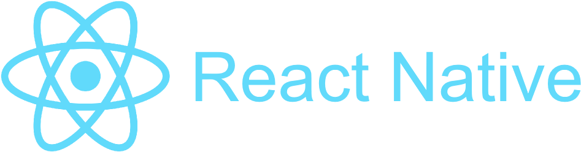
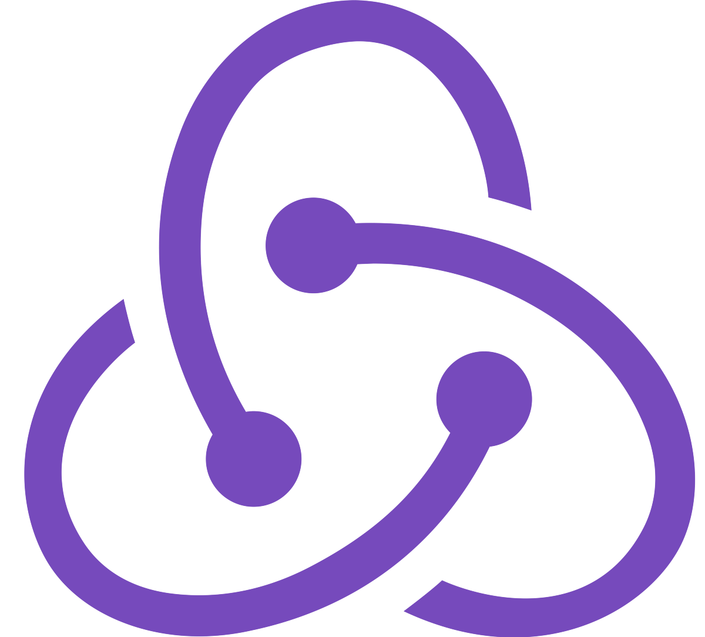
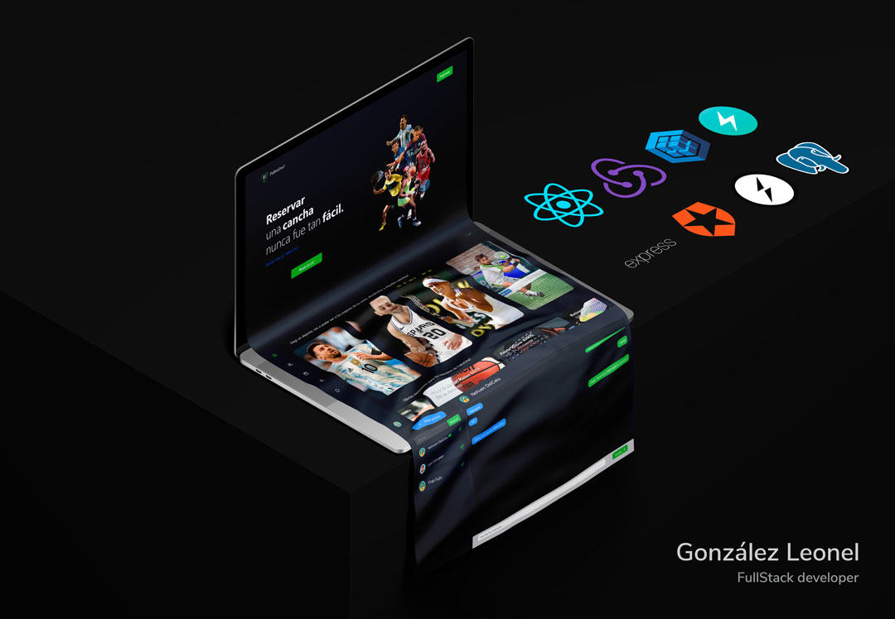
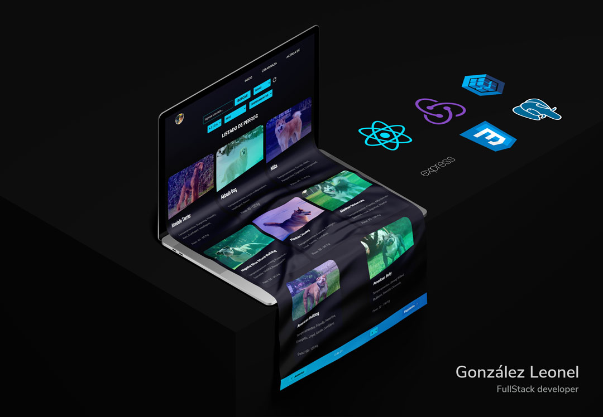

<h1 align="center"> Hola 👋🏽, Yo soy Leonel, Bienvenido/a</h1>

<h3 align="center">
   Sobre mí
</h3>

👀 ¿Quién soy?  
🔹 Desarrollador FullStack con orientación FrontEnd, con la capacidad de desarrollar páginas y aplicaciones web, escalables, modularizadas y optimizadas. ⏱
 
 
🤔 ¿Por qué yo?  
🔸 Más allá de los conocimientos técnicos, soy una persona curiosa, que le encanta aprender y enseñar. 
Me considero una persona detallista, pragmática, proactiva y con buena comunicación. 📣
 
 
🤓 ¿Mi Background?  
✔ Hice mis estudios secundarios en un Instituto Técnico en Informática, donde aprendí las bases del desarrollo de software, creando mis primeros sistemas web. 🖥
  
✔ Me apasioné por este mundo de la programación y continúe especializándome, haciendo cursos de programación y practicando en proyectos personales. 📚
  
✔ Ingresé al Bootcamp soyHenry donde, además de profundizar en las distintas tecnologías, aprendí metodologías agiles, a trabajar en conjunto con otros desarrolladores y comunicarme con profesionales que no sean del rubro IT. 👥
  
✔ Actualmente me encuentro listo para mi primera experiencia laboral en el mundo IT! 😁
 
 
🔔 ¿Creés que soy lo que tu equipo está buscando? No dudes en contactarme. 
 
📤 Email: leogonzalezdev@gmail.com
 
💼 <a href="https://leogonzalez.vercel.app/">Mi Portafolio</a>
 
👥 <a href="https://www.linkedin.com/in/leogonzalezdev/">Mi LinkedIn</a>
 

<h2 align="center">
    Tecnologías con las que trabajo:
</h2>

   
   
   
   
   
   
   
   
   
   
   
   
   
   
   
   

  
 <h3 align="center">
   Mis Proyectos
</h3>

*Falta Uno App* <a href="https://falta-uno-henry.vercel.app/"> Link al proyecto</a>

- Diseñar y desarrollar una App para el alquiler de canchas en complejos deportivos que incluía: Login, agenda, calendario, chat interno, notificaciones y pasarela de pagos.
- Desarrollar la app en React con estilos en CSS, Bootstrap y Chakra-Ui, notificaciones con sendGrid y chat implementado con Socket.io. Back desarrollado en Node con Express, base de datos en PostgreSQL y Sequelize.

  

*DogsApp* <a href="https://pi-dogsapp.vercel.app/"> Link al proyecto</a>

- Diseñar y desarrollar una single-page application en la cual se pueda ver información de distintas razas de perros, filtrarlas, ordenarlas, crear nuevas y eliminarlas. Desarrollado con React JS, Redux, Sequelize, Express y CSS3 Puro, .

  

 
 