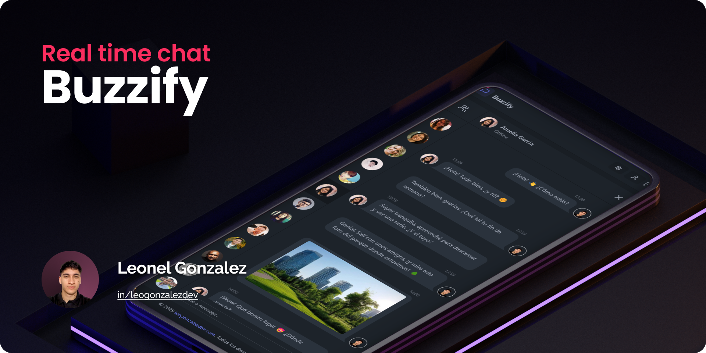
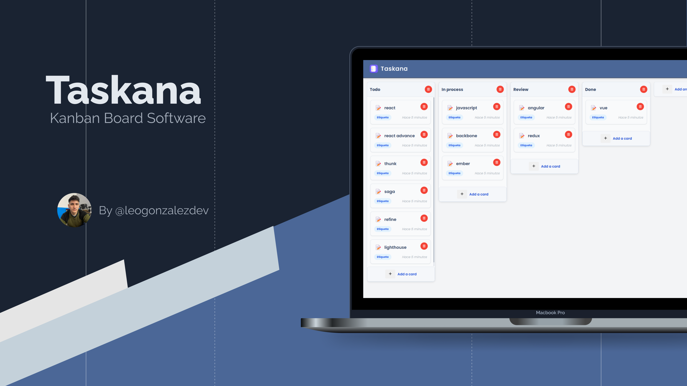

# ¡Hola! 👋🏽 Soy Leonel González

## Sobre mí
¡Bienvenido/a a mi GitHub! Soy un **Desarrollador FullStack** con enfoque en el **Frontend**. Mi pasión está en crear soluciones digitales que combinen funcionalidad y diseño, siempre manteniendo las mejores prácticas en desarrollo y optimización.

### 🎯 Mi camino en el desarrollo
- Comencé mi formación en un Instituto Técnico en Informática, donde adquirí una base sólida en desarrollo de software. 💻
- Durante mi paso por el Bootcamp de **SoyHenry**, trabajé en proyectos colaborativos aplicando tecnologías modernas y metodologías ágiles. 🚀
- Actualmente, sigo desarrollándome profesionalmente con proyectos desafiantes y aprendizaje continuo. 📚

### 💡 Lo que me motiva
El desarrollo de software es mi forma de resolver problemas, crear experiencias significativas y seguir aprendiendo cada día. 

---

## 🌟 Proyectos destacados

### **Buzzify**
[🔗 Ver demo](https://buzzify.leogonzalezdev.com)

- **Descripción:** Buzzify es una aplicación de chat en tiempo real diseñada para ofrecer una experiencia de comunicación rápida, segura y moderna. Combina una interfaz intuitiva con características avanzadas como encriptación AES, autenticación JWT y notificaciones instantáneas con Web Sockets.
- **Tecnologías:** React, Node.js, Express, MongoDB, TailwindCSS.

---

### **Taskana**
[🔗 Ver demo](https://taskana.leogonzalezdev.com)

- **Descripción:** Taskana es una aplicación web de gestión de tareas diseñada exclusivamente en frontend. Utiliza LocalStorage para guardar los datos de forma local y ofrece una interfaz amigable y funcional para organizar proyectos mediante tableros estilo Kanban.
- **Tecnologías:** React 

---

## 📫 ¡Conéctate conmigo!

📧 **Email:** leogonzalezdev@gmail.com  
🌐 **Portafolio:** [leogonzalezdev.com](https://leogonzalezdev.com/)  
👔 **LinkedIn:** [Leonel González](https://www.linkedin.com/in/leogonzalezdev/)
